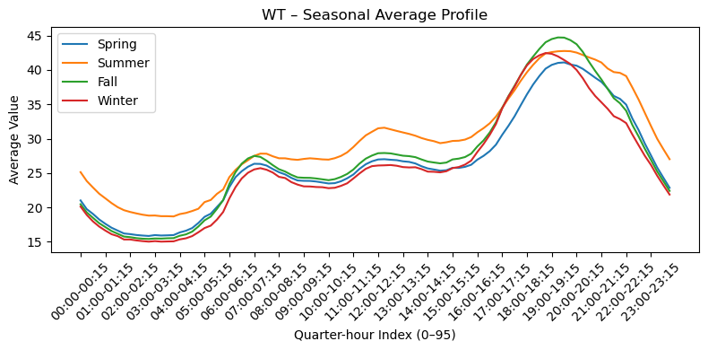
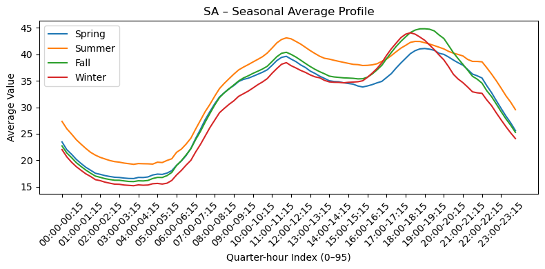
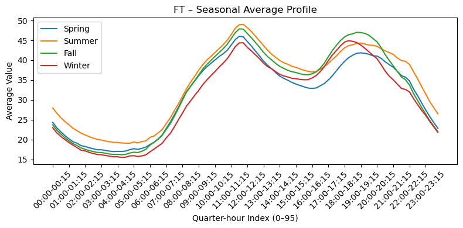
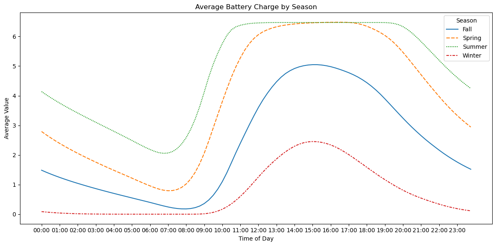

# Solar-House Simulation (SimPy)

## Introduction
This project is an **interactive simulation tool** that models a household equipped with a **photovoltaic (PV) system and battery storage**.  
It allows you to experiment with different system sizes, prices, and usage patterns to explore:

* How the PV system and battery meet household demand over time  
* How much electricity is imported from or exported to the grid  
* The overall financial impact (costs, savings, and revenue from selling surplus energy)

By adjusting key inputs such as PV capacity, battery size, energy prices, initial costs, yearly consumption and timeframes you can quickly see how design choices affect both performance and economics.

---

## Features
* **Discrete-event simulation** built with [SimPy](https://simpy.readthedocs.io/).  
* Models:
  * **SolarPanel** – produces energy based on a quarter-hour solar profile and gradual efficiency loss.  
  * **Battery** – charges/discharges with round-trip efficiency and annual degradation.  
  * **Household** – consumes electricity according to a dynamic BDEW profile, drawing from solar, battery, or the grid as needed.
* **Financial tracking**: calculates grid purchases, feed-in revenue, and total system cost over time.
* Flexible **start and end dates**; simulation can stop after a fixed time or once return-on-investment is reached.

---

## Data

### Household Load Profiles
The household demand is based on the **BDEW H25** standard load profile  
provided by the German Association of Energy and Water Industries (BDEW):

* Source: [BDEW Standard Load Profiles](https://www.bdew.de/energie/standardlastprofile-strom/)

To create a realistic, year-round consumption pattern, the raw H25 profile is combined with the  
**BDEW *Dynamisierungsfunktion***, which adjusts the quarter-hour values for the day of the year  
(seasonal and weekday/holiday effects).

The data gets preprocessed in [household_data.ipynb](household_data.ipynb) and saved in [PV_2024_normalized.csv](data/H25_BDEW.csv).

The simulation distinguishes between **three daily profiles**:

| Profile       | Description                                                                 |
|---------------|-------------------------------------------------------------------------------|
| **Workday (WT)** | Typical working day pattern: higher morning and evening peaks, lower midday usage. |
| **Saturday (SA)** | Weekend schedule with later morning start and steady consumption through the day, higher midday usage. |
| **Holiday/Sunday (FT)** | Similar to Saturday higher peaks. |


**Workday (WT)**



**Saturday (SA)**



**Holiday/Sunday (FT)**



### Solar (PV) Data
The solar generation data uses measured PV output for Germany from the **SMARD** market data portal:

* Source: [SMARD – Marktdata PV Generation](https://www.smard.de/page/home/marktdaten/78?marketDataAttributes=%7B%22resolution%22:%22hour%22,%22from%22:1757887200000,%22to%22:1757973599999,%22moduleIds%22:%5B5000410,1004068%5D,%22selectedCategory%22:null,%22activeChart%22:true,%22style%22:%22color%22,%22categoriesModuleOrder%22:%7B%7D,%22region%22:%22DE%22%7D)

The simulation uses the **full year of 2024** PV generation data as the base for solar efficiency,  
ensuring that the PV system’s behavior reflects realistic weather and seasonal variations across an entire year.

The data gets preprocessed in [solar_data.ipynb](solar_data.ipynb) and saved in [PV_2024_normalized.csv](data/PV_2024_normalized.csv).

**Seasonal PV Efficiency – Winter, Spring, Summer, Fall**


**PV Efficiency 2024-01-01**


## How It Works
The simulation advances in **15-minute steps** (96 per day):

1. **Solar generation** is read from a weather/irradiance profile (`df_solar_profile`) scaled by system size (`kWp`) and panel degradation.  
2. **Household demand** is drawn from a standard BDEW quarter-hour profile, adjusted by day of week, holidays, and a *dynamisierungsfunktion* for variation.  
3. The household:
   * Uses solar production first
   * Draws from the battery if needed
   * Imports from the grid for any remaining demand
   * Exports surplus solar to the grid
4. Costs and revenues (buy price vs. feed-in price) are accumulated.

While the simulation is running both battery and Solar Panels lose efficency:
* Solar Panels lose ~0.3%(0.003) - 0.8%(0.008) efficency per year -> set to 0.5% (`self.loss = 0.005`)
* Batteries lose ~1%(0.01) - 4%(0.04) efficency per year -> set to 3% (`self.loss = 0.03`)

---

## Usage

### 1. Install Dependencies
pip:
```bash
python3 -m venv env
source env/bin/activate
pip install -r requirements.txt
```

conda:
```bash
conda create --name <env_name> --file environment.yml
```

### 2. Set Values in [simulation.ipynb](simulation.ipynb)

```bash
####################### Variables:
# energy prices
kWh_buy_price = 0.4
kWh_sell_price = 0.08
# house
initial_cost = 25000
yearly_consumption_kWh = 5000
# battery
capacity_kWh = 7.5
# solar
kWp = 7
# timeframe
start_date=datetime.date(2025, 1, 1)
end_date = datetime.date(2035, 1, 1)
# stop early if PV cheaper than house without PV
until_roi=True
#######################
```

### 3. Run [simulation.ipynb](simulation.ipynb)

## Example run

```bash
####################### Variables:
# energy prices
kWh_buy_price = 0.4
kWh_sell_price = 0.08
# house
initial_cost = 25000
yearly_consumption_kWh = 5000
# battery
capacity_kWh = 7.5
# solar
kWp = 7
# timeframe
start_date=datetime.date(2025, 1, 1)
end_date = datetime.date(2045, 1, 1)
# stop early if PV cheaper than house without PV
until_roi=True
#######################
```

I let this simulation run and the results are:

## Simulation Results

**End Condition**  
* Finished after **4688.40 days** (≈ **12.8 years**)  
* Date reached: **2 November 2037**  
* Final simulation time: **450 085 quarter-hours** (≈ 12.8 years)

---

### System Efficiency at End of Simulation
* **Solar panel efficiency:** **0.94 %** of original  
* **Battery capacity:** **0.68 %** of original

---

### Energy Summary
* **Total household electricity used:** **64 097.75 kWh**  
* **Solar energy consumed directly by household:** **28 316.19 kWh**  
* **Energy supplied from the battery:** **20 404.81 kWh**  
* **Energy imported from the grid:** **15 376.74 kWh**  
* **Energy exported to the grid:** **68 895.39 kWh**

---

### Financials
* **Grid electricity purchased (cost):** **€ 6 150.70**  
* **Grid electricity sold (revenue):** **€ 5 511.63**  
* **Total household cost without PV system:** **€ 25 639.10**  
* **Total cost with PV + battery (including initial investment):** **€ 25 639.06**

Another result is the Average Battery Charge for the simulation:



You can see how it has way more Charge in Summer and Spring compared to Winter.